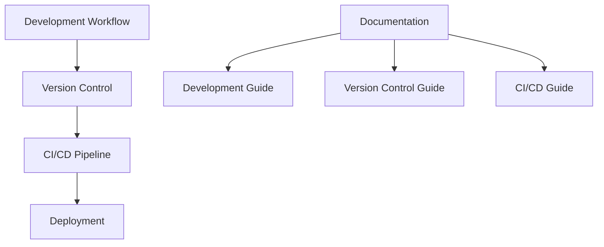

# Team Development Documentation

## Overview
This repository contains comprehensive documentation for team development processes, workflows, and best practices.

## Documentation Structure

### 1. Development Workflow
- [Development Workflow Guide](workflow/development-workflow.md)
  - Development Process
  - Sprint Workflow
  - Daily Workflow
  - Communication Channels
  - Tools and Resources
  - Best Practices
  - Performance Metrics

### 2. Version Control
- [Version Control Guide](workflow/version-control.md)
  - Branch Structure
  - Branch Lifecycle
  - Release Process
  - Hotfix Process
  - Versioning
  - Best Practices

### 3. CI/CD Pipeline
- [CI/CD Pipeline Guide](workflow/ci-cd-pipeline.md)
  - Pipeline Overview
  - Pipeline Stages
  - Branch Pipeline Rules
  - Environment Configuration
  - Deployment Strategy
  - Monitoring and Alerts
  - Rollback Procedures
  - Best Practices

## Documentation Flow

## Getting Started

1. **Development Workflow**
   - Start with [Development Workflow Guide](workflow/development-workflow.md)
   - Understand team processes and practices
   - Learn about communication and tools

2. **Version Control**
   - Review [Version Control Guide](workflow/version-control.md)
   - Master Git workflow and branching
   - Learn release and hotfix procedures

3. **CI/CD Pipeline**
   - Study [CI/CD Pipeline Guide](workflow/ci-cd-pipeline.md)
   - Understand deployment strategies
   - Learn monitoring and rollback procedures

## Contributing Guidelines

1. **Documentation Updates**
   - Create a new branch for changes
   - Follow existing documentation structure
   - Update relevant sections
   - Ensure all links are working

2. **Code Changes**
   - Follow version control workflow
   - Update documentation if needed
   - Include necessary diagrams
   - Add examples where helpful

3. **Review Process**
   - Submit pull request
   - Get team review
   - Update based on feedback
   - Merge when approved

## Best Practices

1. **Documentation**
   - Keep content up-to-date
   - Use clear and concise language
   - Include practical examples
   - Add visual diagrams

2. **Version Control**
   - Follow branching strategy
   - Write clear commit messages
   - Keep branches short-lived
   - Regular cleanup

3. **CI/CD**
   - Maintain pipeline efficiency
   - Regular security updates
   - Monitor performance
   - Test thoroughly

## License
MIT License 