# CI/CD Pipeline with GitFlow and Workflow

## Pipeline Overview

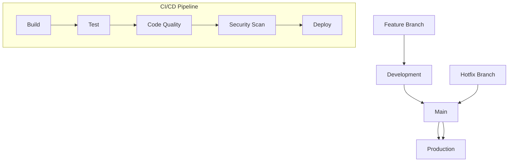

## Pipeline Stages

### 1. Build Stage
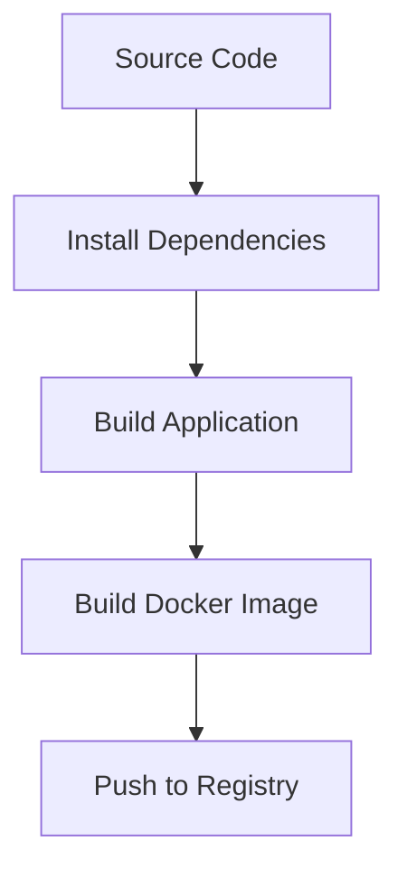

### 2. Test Stage
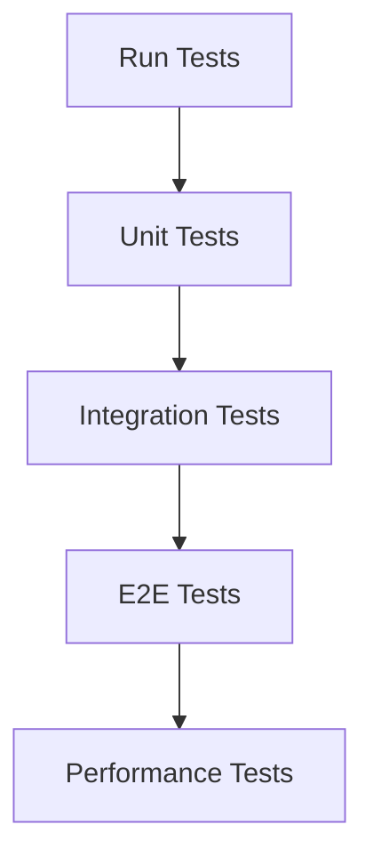

### 3. Quality Stage
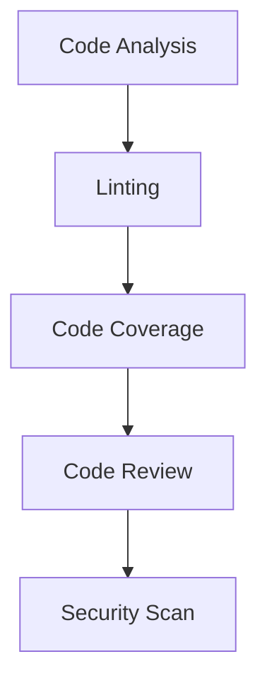

### 4. Deploy Stage
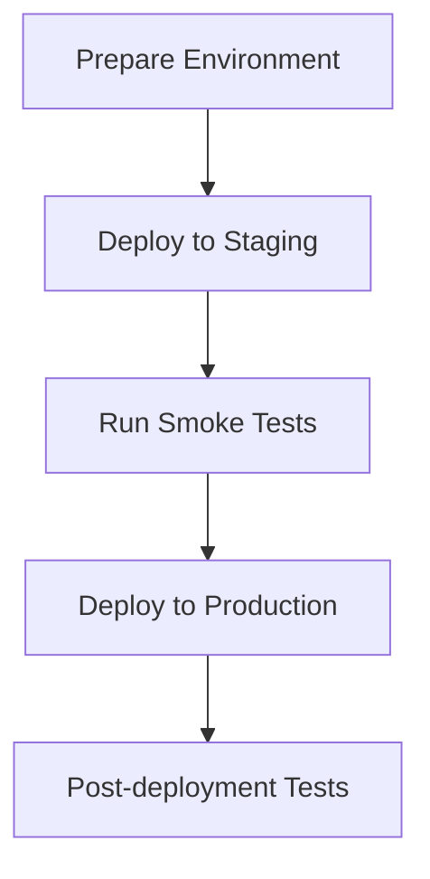

## Branch Pipeline Rules

### Feature Branch Pipeline
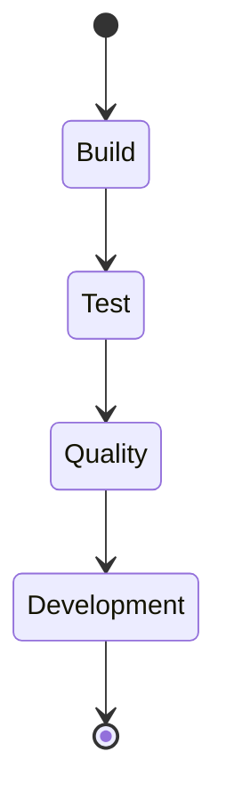

1. **Trigger Conditions**
   - Push to feature branch
   - Pull request created
   - Manual trigger

2. **Required Checks**
   - Build successful
   - All tests passing
   - Code coverage > 80%
   - No security vulnerabilities
   - Code review approved

### Development Branch Pipeline
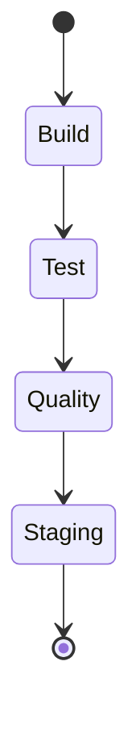

1. **Trigger Conditions**
   - Merge to development
   - Scheduled builds
   - Manual trigger

2. **Required Checks**
   - All feature branch checks
   - Integration tests
   - Performance tests
   - Security scan

### Main Branch Pipeline
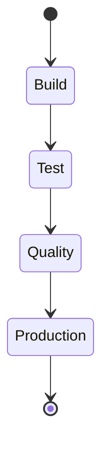

1. **Trigger Conditions**
   - Merge to main
   - Hotfix merge
   - Manual trigger

2. **Required Checks**
   - All development checks
   - Production environment tests
   - Backup verification
   - Rollback plan

## Environment Configuration

### Development
```yaml
environment: development
database: dev-db
api: dev-api
monitoring: dev-monitoring
```

### Staging
```yaml
environment: staging
database: staging-db
api: staging-api
monitoring: staging-monitoring
```

### Production
```yaml
environment: production
database: prod-db
api: prod-api
monitoring: prod-monitoring
```

## Deployment Strategy

### Blue-Green Deployment
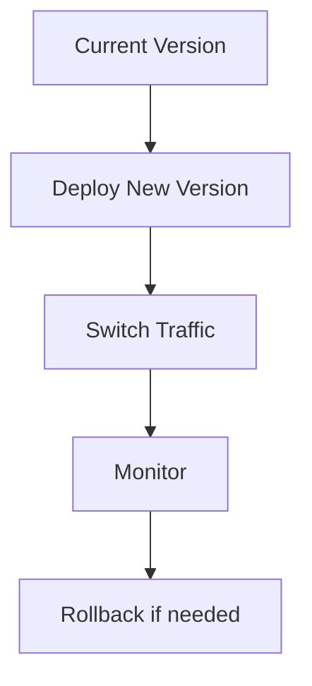

### Canary Deployment
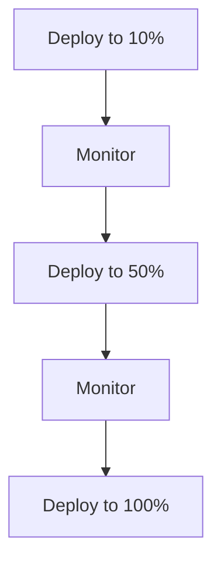

## Monitoring and Alerts

### Metrics to Monitor
1. **Application Metrics**
   - Response time
   - Error rate
   - Request rate
   - Resource usage

2. **Infrastructure Metrics**
   - CPU usage
   - Memory usage
   - Disk usage
   - Network traffic

### Alert Rules
```yaml
alerts:
  - name: high_error_rate
    condition: error_rate > 1%
    duration: 5m
    severity: critical
    
  - name: high_latency
    condition: response_time > 500ms
    duration: 5m
    severity: warning
```

## Rollback Procedures

### Automatic Rollback
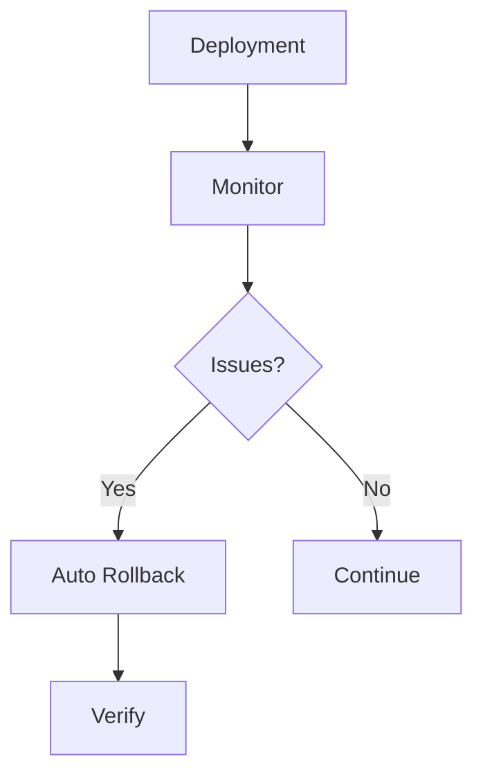

### Manual Rollback
1. **Steps**
   - Identify issue
   - Stop deployment
   - Revert to last stable version
   - Verify system health

2. **Verification**
   - Check logs
   - Monitor metrics
   - Run smoke tests
   - Verify data integrity

## Best Practices

### Pipeline
1. **Speed**
   - Parallel jobs
   - Caching
   - Optimized builds
   - Selective testing

2. **Reliability**
   - Idempotent deployments
   - Automated rollbacks
   - Health checks
   - Backup procedures

3. **Security**
   - Secrets management
   - Access control
   - Security scanning
   - Compliance checks

### Deployment
1. **Strategy**
   - Blue-green deployment
   - Canary releases
   - Feature flags
   - Gradual rollout

2. **Monitoring**
   - Real-time metrics
   - Alert thresholds
   - Log aggregation
   - Performance tracking 