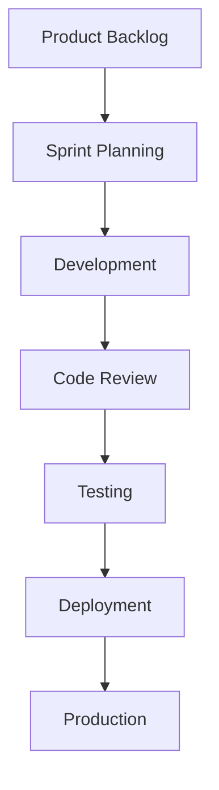
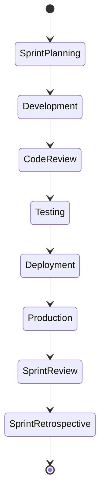
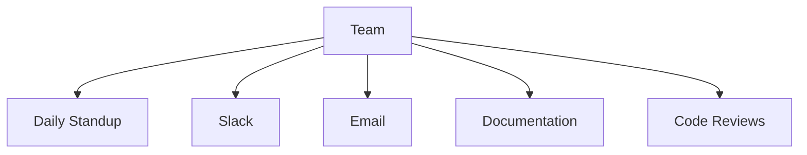
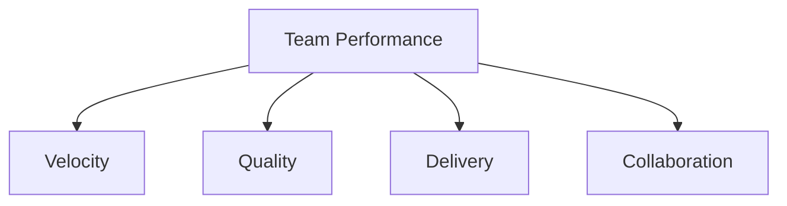
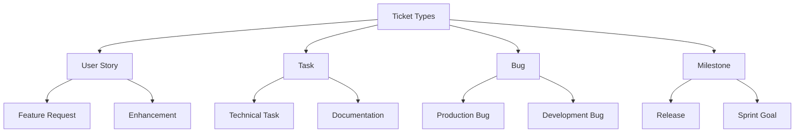
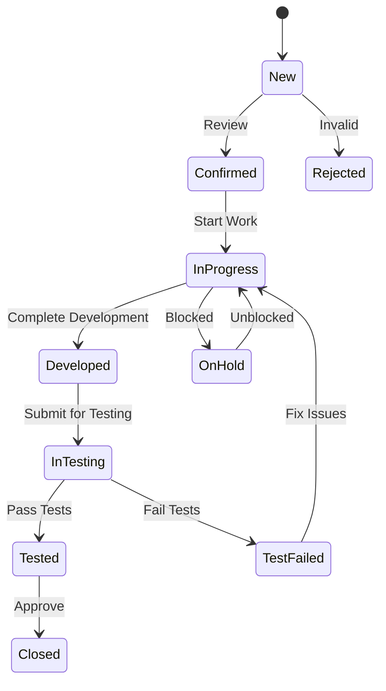
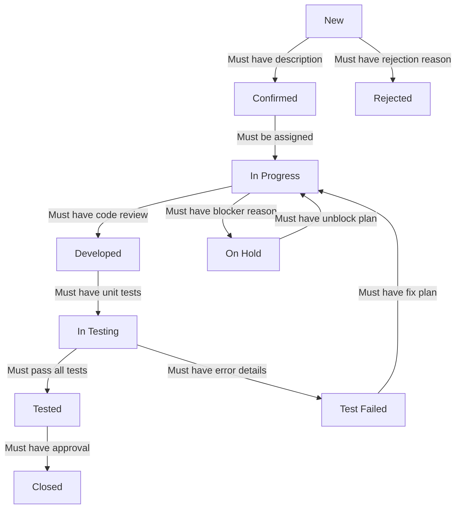

# Team Development Workflow

## Development Process



## Sprint Workflow



## Daily Workflow

### Morning
1. **Daily Standup** (15 minutes)
   - What did you do yesterday?
   - What will you do today?
   - Any blockers?

### Development
1. **Task Selection**
   - Pick task from sprint board
   - Update task status
   - Create feature branch

2. **Development Process**
   ```mermaid
   graph TD
       A[Select Task] --> B[Create Branch]
       B --> C[Development]
       C --> D[Local Testing]
       D --> E[Push Changes]
       E --> F[Create PR]
       F --> G[Code Review]
       G --> H[Merge]
   ```

3. **Code Review Process**
   - Self-review checklist
   - Peer review
   - Address feedback
   - Merge when approved

### Testing
1. **Testing Process**
   ```mermaid
   graph TD
       A[Test Plan] --> B[Unit Tests]
       B --> C[Integration Tests]
       C --> D[E2E Tests]
       D --> E[Performance Tests]
       E --> F[Security Tests]
   ```

2. **Quality Gates**
   - Code coverage > 80%
   - All tests passing
   - No security vulnerabilities
   - Performance benchmarks met

## Communication Channels

### Team Communication


### Meeting Schedule
1. **Daily**
   - Standup: 9:00 AM
   - Team Sync: 4:00 PM

2. **Weekly**
   - Sprint Planning: Monday 10:00 AM
   - Sprint Review: Friday 2:00 PM
   - Sprint Retrospective: Friday 3:00 PM

3. **Monthly**
   - Team Building: Last Friday
   - Technical Review: First Monday

## Tools and Resources

### Development Tools
1. **Version Control**
   - Git
   - GitHub/GitLab
   - Git Flow

2. **Project Management**
   - Jira/Trello
   - Confluence
   - Slack

3. **Development Environment**
   - IDE: VS Code/IntelliJ
   - Docker
   - Local development setup

### Documentation
1. **Required Documentation**
   - API Documentation
   - Architecture Decisions
   - Setup Guides
   - Troubleshooting Guides

2. **Documentation Standards**
   - Use Markdown
   - Include examples
   - Keep updated
   - Version control

## Best Practices

### Code Quality
1. **Coding Standards**
   - Follow style guide
   - Write clean code
   - Document code
   - Use meaningful names

2. **Testing**
   - Write unit tests
   - Integration tests
   - E2E tests
   - Performance tests

### Collaboration
1. **Code Review**
   - Be constructive
   - Respond promptly
   - Explain changes
   - Follow checklist

2. **Knowledge Sharing**
   - Document decisions
   - Share learnings
   - Mentor others
   - Regular tech talks

## Performance Metrics

### Team Metrics


### Individual Metrics
1. **Code Quality**
   - Test coverage
   - Code review participation
   - Bug fixes
   - Documentation

2. **Delivery**
   - Story points completed
   - On-time delivery
   - Technical debt reduction
   - Innovation contributions 

## Ticket Management

### Ticket Types


### Ticket Status Flow


### Ticket Type Descriptions

1. **User Story**
   - Represents a feature or functionality from user's perspective
   - Format: "As a [user type], I want [goal] so that [benefit]"
   - Must include acceptance criteria
   - Links to business value

2. **Task**
   - Represents a specific piece of work
   - Usually technical in nature
   - Can be part of a User Story
   - Includes implementation details

3. **Bug**
   - Represents an issue or defect
   - Must include reproduction steps
   - Priority level required
   - Environment details needed

4. **Milestone**
   - Represents a significant achievement
   - Contains multiple User Stories/Tasks
   - Used for project planning
   - Has specific deadline

### Status Descriptions

1. **New**
   - Initial state when ticket is created
   - Needs review and validation
   - No work started yet

2. **Confirmed**
   - Ticket has been reviewed
   - Requirements are clear
   - Ready for development
   - Priority assigned

3. **In Progress**
   - Work has started
   - Developer is actively working
   - Regular updates required
   - Time tracking active

4. **Developed**
   - Development work is complete
   - Code is ready for testing
   - Documentation updated
   - Self-review done

5. **In Testing**
   - Ticket is being tested
   - QA team is verifying
   - Test cases executed
   - Results documented

6. **Tested**
   - Testing is complete
   - All tests have passed
   - Ready for review
   - Documentation verified

7. **Test Failed**
   - Issues found during testing
   - Needs fixes
   - Detailed feedback provided
   - Priority reassessment

8. **Closed**
   - Work is complete
   - All criteria met
   - Documentation updated
   - Stakeholder approved

9. **On Hold**
   - Work is temporarily paused
   - Blocked by dependencies
   - Waiting for input
   - Regular status updates

10. **Rejected**
    - Ticket is invalid
    - Won't be implemented
    - Reason documented
    - Alternative suggested

### Status Transition Rules
