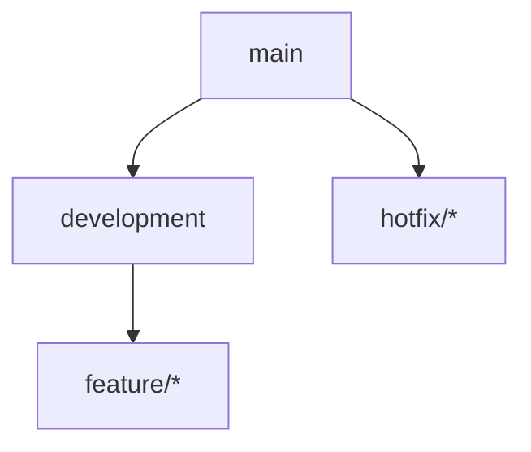
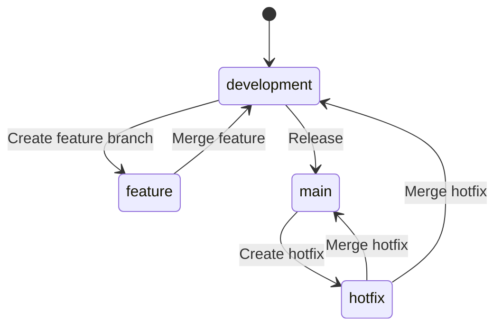
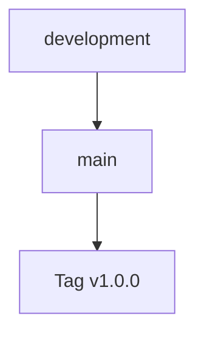
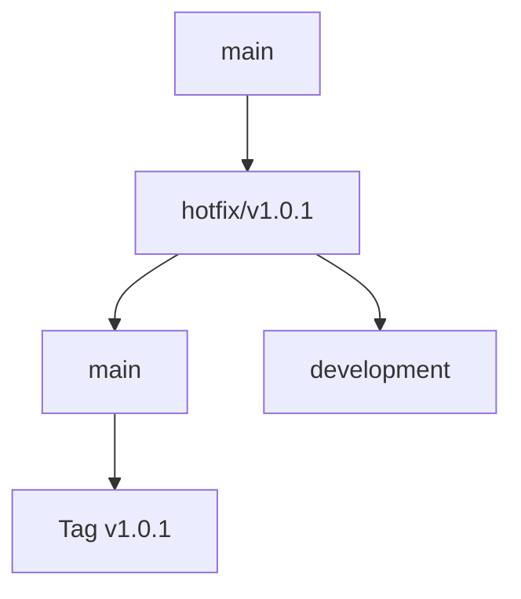
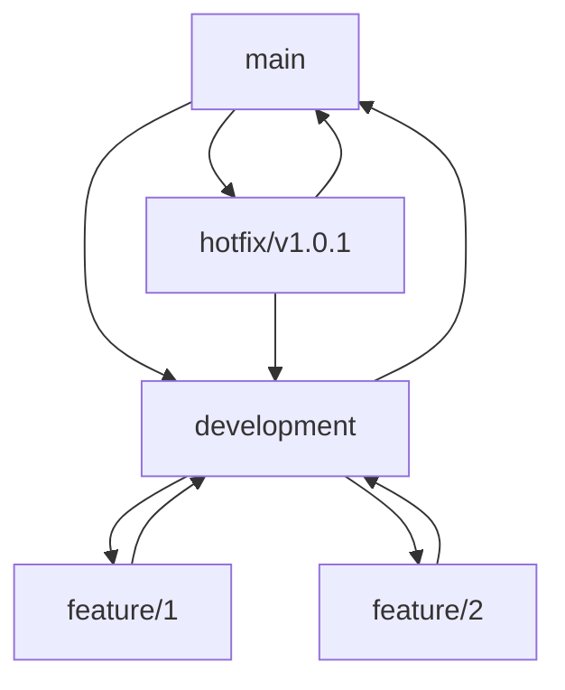

# Git Workflow Documentation

## Branch Structure

### Main Branches



1. **main**
   - Production-ready code
   - Always stable and deployable
   - Protected branch
   - Only updated through direct merges from development and hotfixes

2. **development**
   - Integration branch for features
   - Base branch for feature development
   - Contains latest delivered development changes
   - Merged into main when stable

3. **feature branches**
   - Branch from: development
   - Merge back into: development
   - Naming convention: feature/*

## Branch Lifecycle



## Release Process

### Direct Release from Development


1. **Release Steps**
   - Ensure all features are tested in development
   - Create release tag on development
   - Merge development into main
   - Tag the release on main
   - Deploy from main

### Hotfix Process



1. **Creating Hotfix**
   - Branch from: main
   - Naming: hotfix/v*.*.*
   - Emergency fixes for production

2. **Hotfix Steps**
   - Create hotfix branch from main
   - Fix the issue
   - Merge to main and tag
   - Merge to development

## Versioning

### Semantic Versioning (MAJOR.MINOR.PATCH)
- **MAJOR**: Incompatible API changes
- **MINOR**: Backwards-compatible functionality
- **PATCH**: Backwards-compatible bug fixes

### Tag Format
```bash
v1.0.0
v1.0.1
v1.1.0
v2.0.0
```

## Best Practices

1. **Branch Management**
   - Keep branches short-lived
   - Regular cleanup of merged branches
   - Use meaningful branch names
   - Follow naming conventions

2. **Commits**
   - Write clear commit messages
   - Use conventional commits format
   - Keep commits atomic and focused
   - Reference issue numbers

3. **Code Review**
   - Require pull request reviews
   - Enforce branch protection rules
   - Run automated tests
   - Check code style and quality

4. **Release Management**
   - Regular release schedule
   - Clear release notes
   - Version tracking
   - Automated deployment

## Common Commands

```bash
# Feature branch
git checkout development
git pull
git checkout -b feature/new-feature
git push -u origin feature/new-feature

# Release process
git checkout development
git pull
git checkout main
git merge development
git tag -a v1.0.0 -m "Release version 1.0.0"
git push origin main
git push origin v1.0.0

# Hotfix branch
git checkout main
git checkout -b hotfix/v1.0.1
git push -u origin hotfix/v1.0.1
```

## Workflow Diagram

